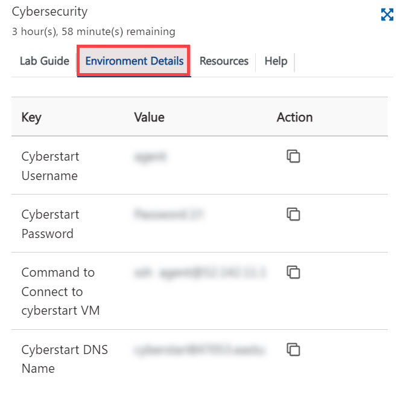
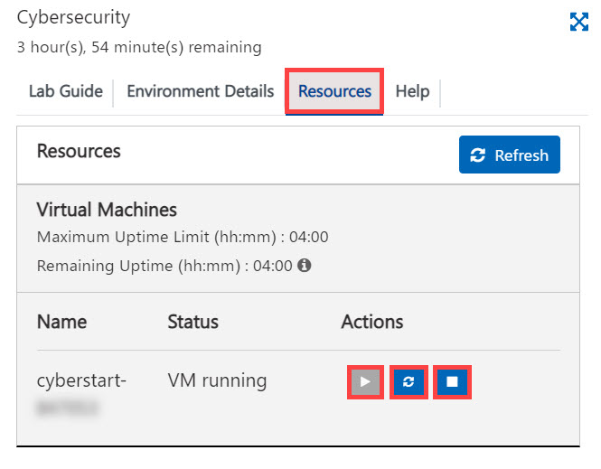

# Getting Started with Lab

1. The cloud lab (virtual machine) is a **sandbox environment** and thus has a limited session duration, as shown near the header above.

2. The lab environment includes a Virtual Machine on the left and the lab guide on the right.

3. To find the Virtual Machine details, select **Environment Details** tab in the lab guide. 

   
 

## Resource Start/Stop

Please follow the below steps to start/stop the VM: 

1. To start/restart/stop the VM, navigate to the **Resources** tab and select the appropriate buttons.

   
   

